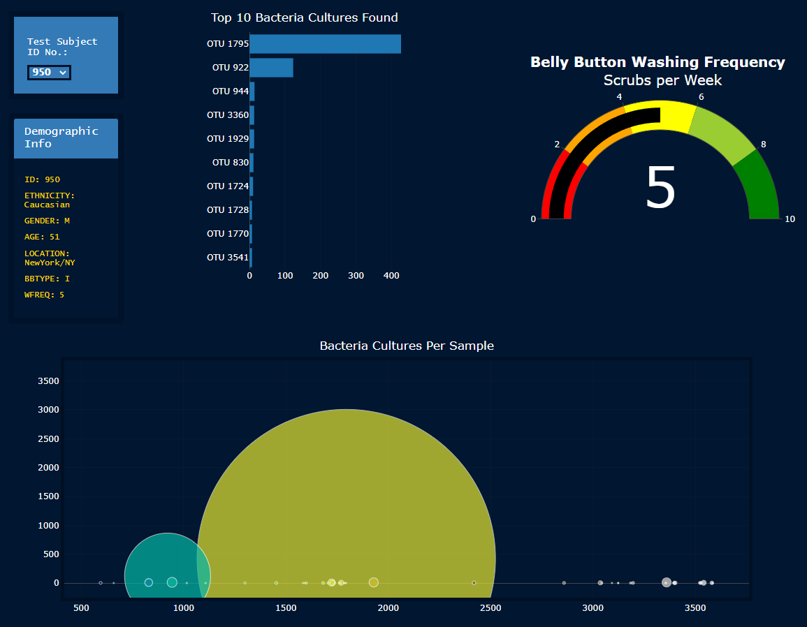
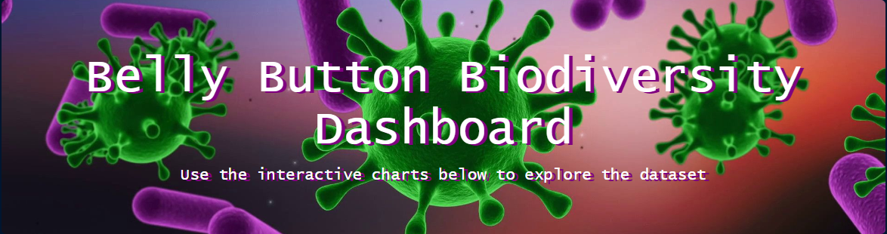
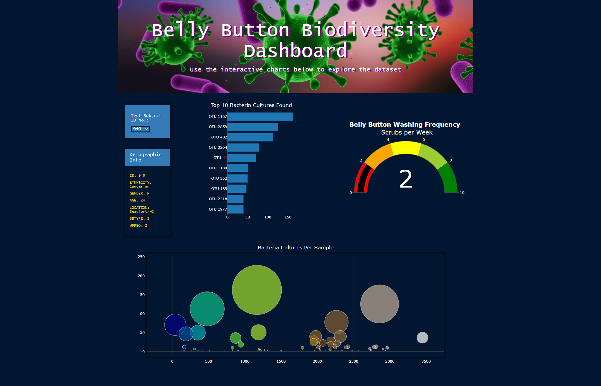
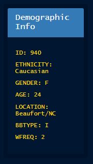

# Bellybutton Biodiversity using Plotly

## Project Overview
In this assignment, we assisted a biological researcher named Roza who works in a microbiology laboratory. Roza job duties are to discover and document bacterial species that are not well studied or unknown. 

Roza's lab has partnered with Improbable Beef, a food startup researching bacterial species that have the ability to synthesize proteins that taste like beef.

Roza hypothesizes that the ideal bacterial species to make synthetic beef may be found in belly buttons of some people. Roza sampled the bellybutton bacteria of people across the country and assigned them an ID number to keep participants anonymous.

Roza was tasked with building a dashboard to provide her participants and researchers access to her findings. We created 3 different responsive charts that change depending on the selected ID number from the dropdown menu. 
 

## Interactivity & Customizations
Roza's dashboard was built, testing, and determined to be operating as expected. When an ID number is selected from the drop down menu, the demographic information and the 3 charts (bar, gauge, and bubble charts) are changed to display the information specific to that ID number.

  
### 3 Levels of Customizations
 
1. Background image added to the header of our dashboard, as well as text shadow.

 
2. The entire page, as well as charts, have a new dark-blue colorscheme.
 This required customizations in the CSS file, as well as within the charts.js file for each individual chart.

 
3. The font style was changed across the dashboard, as seen in the title from the images above, as well as in the 'Demographic Info' section.

## Summary
Roza's dashboard consists of an easy-to-view layout, responsive charts to display multiple data points of a given ID number, as well as a dark theme that makes it easier to view/read in lower light conditions. The color scheme does not distract the viewer from the pertinent information provided in the visuals.

With this data, researchers and participants can identify the types of bacterial species found in various bellybuttons, and strengthen the overall objective of finding a bacterial species that have the ability to synthesize proteins that taste like beef.